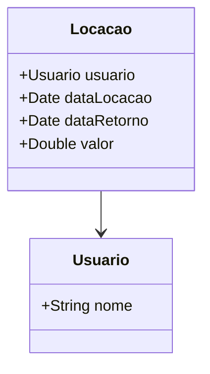

# Testes Unitários - JUnit

Este repositório contém o código desenvolvido ao longo do curso sobre **Testes Unitários com Java - JUnit**.

## Estrutura do Repositório

```bash
TestesUnitarios/
├── .idea/
├── libs/
├── src/
│   ├── main/
│   └── test/
├── .classpath
├── .gitignore
├── .project
└── pom.xml
```

## Diagrama de classes


## Instalação
1 - Clone o repositório:
`git clone https://github.com/chrissperb/TestesUnitarios.git`

2 - Navegue até o diretório do projeto:
`cd testes-unitarios`

3 - Importe o projeto na sua IDE de preferência (recomendado: IntelliJ IDEA).

4 - Compile e execute o projeto utilizando as configurações do Maven.

## Como Usar
O ponto de entrada do programa é a classe Main. Você pode executar esta classe para ver exemplos de locações de filmes. Nas pastas de testes existem os testes para cada método criado. Além disso, os métodos também podem ter sido testados de mais de uma maneira nos testes.

## Contribuições
Sinta-se à vontade para contribuir com melhorias e novas funcionalidades. Para contribuir:
1 - Faça um fork deste repositório.

2 - Crie uma branch para sua feature/bugfix: `git checkout -b feature/nova-funcionalidade`

3 - Commit suas mudanças: `git commit -m 'Adiciona nova funcionalidade'`

4 - Envie para a branch original: `git push origin feature/nova-funcionalidade`

5 - Abra um Pull Request.


## Agradecimentos
Agradeço ao professor Francisco Wagner Costa Aquino e à Udemy pelas orientações e desafio!
